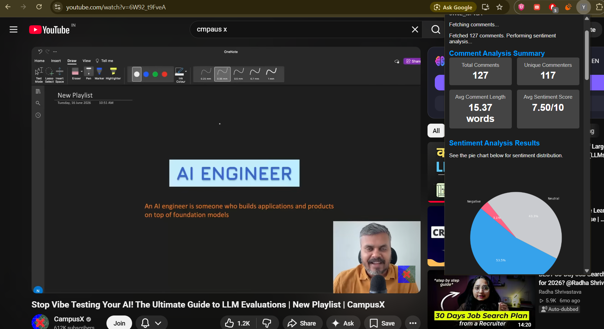
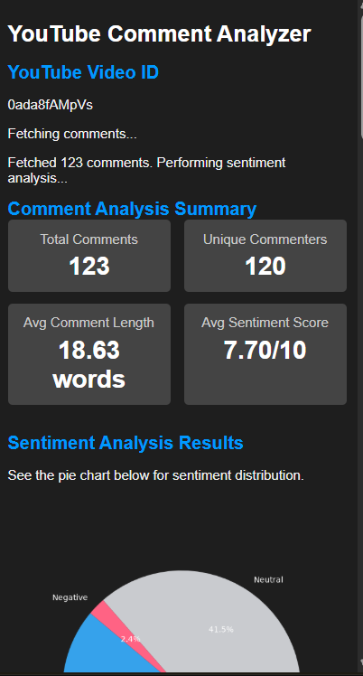
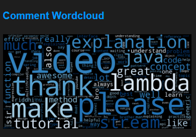

yt-comment-sentiment-analysis
==============================

A small chrome plugin to detect youtube comment sentiments
==============================
Snaps:






Project Organization
------------

    ├── LICENSE
    ├── Makefile           <- Makefile with commands like `make data` or `make train`
    ├── README.md          <- The top-level README for developers using this project.
    ├── data
    │   ├── external       <- Data from third party sources.
    │   ├── interim        <- Intermediate data that has been transformed.
    │   ├── processed      <- The final, canonical data sets for modeling.
    │   └── raw            <- The original, immutable data dump.
    │
    ├── docs               <- A default Sphinx project; see sphinx-doc.org for details
    │
    ├── models             <- Trained and serialized models, model predictions, or model summaries
    │
    ├── notebooks          <- Jupyter notebooks. Naming convention is a number (for ordering),
    │                         the creator's initials, and a short `-` delimited description, e.g.
    │                         `1.0-jqp-initial-data-exploration`.
    │
    ├── references         <- Data dictionaries, manuals, and all other explanatory materials.
    │
    ├── reports            <- Generated analysis as HTML, PDF, LaTeX, etc.
    │   └── figures        <- Generated graphics and figures to be used in reporting
    │
    ├── requirements.txt   <- The requirements file for reproducing the analysis environment, e.g.
    │                         generated with `pip freeze > requirements.txt`
    │
    ├── setup.py           <- makes project pip installable (pip install -e .) so src can be imported
    ├── src                <- Source code for use in this project.
    │   ├── __init__.py    <- Makes src a Python module
    │   │
    │   ├── data           <- Scripts to download or generate data
    │   │   └── make_dataset.py
    │   │
    │   ├── features       <- Scripts to turn raw data into features for modeling
    │   │   └── build_features.py
    │   │
    │   ├── models         <- Scripts to train models and then use trained models to make
    │   │   │                 predictions
    │   │   ├── predict_model.py
    │   │   └── train_model.py
    │   │
    │   └── visualization  <- Scripts to create exploratory and results oriented visualizations
    │       └── visualize.py
    │
    └── tox.ini            <- tox file with settings for running tox; see tox.readthedocs.io


--------
# YouTube Comment Sentiment Analysis

A machine learning-powered web application for analyzing sentiment in YouTube comments. The system classifies comments into **Positive**, **Neutral**, and **Negative** categories using a trained LightGBM model and provides visual insights through sentiment distribution charts, trend analysis, and word clouds.

---

## Features

* Analyze sentiment of YouTube comments
* Classify comments as Positive, Neutral, or Negative
* Generate sentiment distribution visualizations
* Create monthly sentiment trend graphs
* Generate word clouds from comment data
* REST API built with Flask
* Version-controlled ML artifacts using DVC
* Lightweight and scalable inference pipeline

---

## Project Setup

### Clone the Repository

```bash
git clone https://github.com/yourusername/yt-comment-sentiment-analysis.git
cd yt-comment-sentiment-analysis
```

### Create and Activate Virtual Environment

#### Linux / macOS

```bash
python -m venv venv
source venv/bin/activate
```

#### Windows

```bash
python -m venv venv
venv\Scripts\activate
```

### Install Dependencies

```bash
pip install -r requirements.txt
pip install -e .
```

---

## Model and Asset Management with DVC

The trained model, TF-IDF vectorizer, and processed artifacts are versioned using **Data Version Control (DVC)** and stored in remote storage.

### Restore Tracked Artifacts

To download the exact model and vectorizer versions associated with the current Git commit:

```bash
dvc pull
```

This command restores:

```text
models/
├── lgbm_model.pkl
└── tfidf_vectorizer.pkl
```

### Track Updated Model Artifacts

If you retrain the model or update the vectorizer:

```bash
dvc add models/lgbm_model.pkl
dvc add models/tfidf_vectorizer.pkl

git add models/lgbm_model.pkl.dvc
git add models/tfidf_vectorizer.pkl.dvc
git add .gitignore

git commit -m "chore: update tracked model artifacts via DVC"
```

---

## Technology Stack

### Backend

* Flask 3.1.3
* Flask-CORS 6.0.5

### Machine Learning

* LightGBM 4.6.0
* Scikit-learn 1.9.0
* Joblib 1.5.3

### Data Processing

* NumPy 2.4.6
* Pandas 2.3.3

### Natural Language Processing

* NLTK 3.9.4
* Regex 2026.5.9

### Visualization

* Matplotlib 3.11.0
* WordCloud 1.9.6

---

## Running the Application

Start the Flask server:

```bash
python flask_app/app.py
```

Or, if using Flask commands:

```bash
flask run
```

The application will be available at:

```text
http://localhost:5000
```

---

## API Capabilities

### Sentiment Prediction

Analyze comments and predict sentiment labels.

### Sentiment Distribution

Generate charts showing the proportion of positive, neutral, and negative comments.

### Trend Analysis

Visualize sentiment changes over time using monthly trend graphs.

### Word Cloud Generation

Generate word clouds highlighting the most frequently occurring terms in comments.

---

## Project Structure

```text
yt-comment-sentiment-analysis/
│
├── flask_app/
│   ├── app.py
│   └── routes/
│
├── models/
│   ├── lgbm_model.pkl
│   ├── tfidf_vectorizer.pkl
│   └── *.dvc
│
├── notebooks/
│
├── data/
│
├── requirements.txt
├── dvc.yaml
├── dvc.lock
└── README.md
```

---

## Future Enhancements

* Real-time YouTube comment fetching
* Transformer-based sentiment models (BERT/RoBERTa)
* Interactive dashboards
* Multi-language sentiment analysis
* User authentication and project management

---

## License

This project is licensed under the MIT License. Feel free to use, modify, and distribute it according to the license terms.
